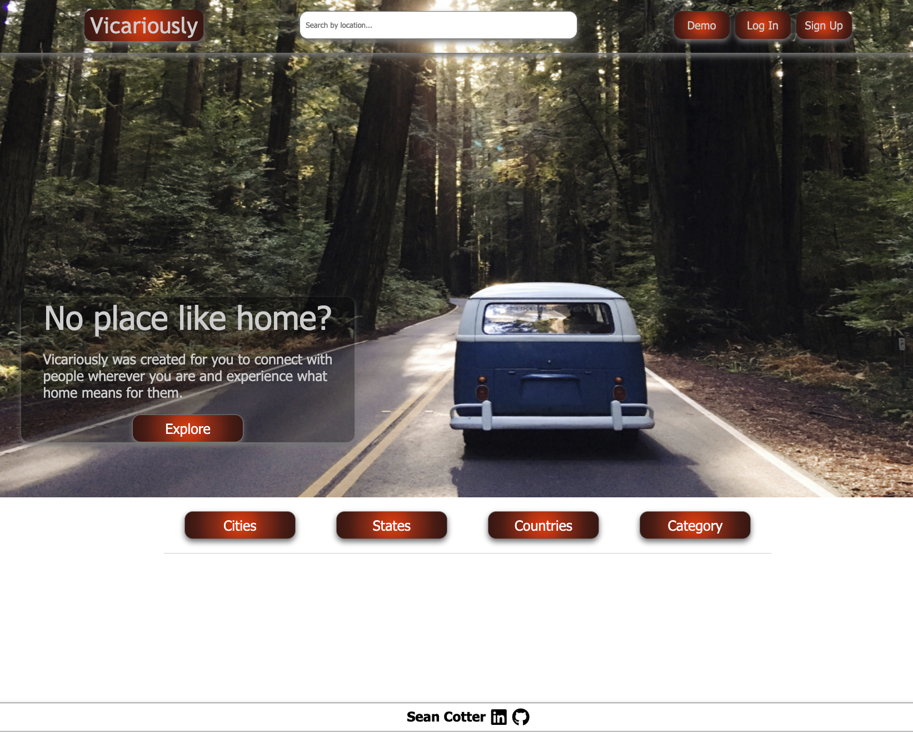
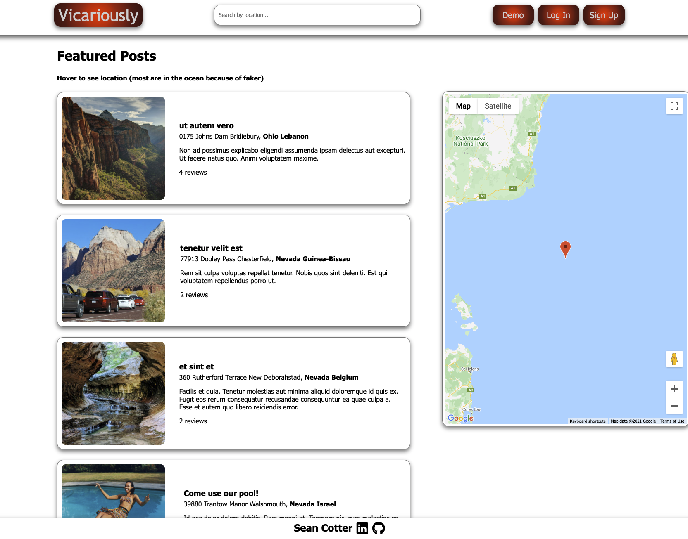
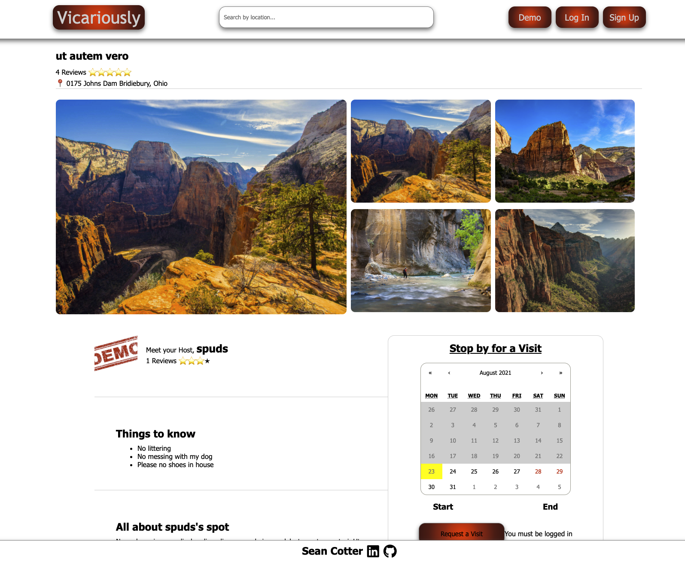
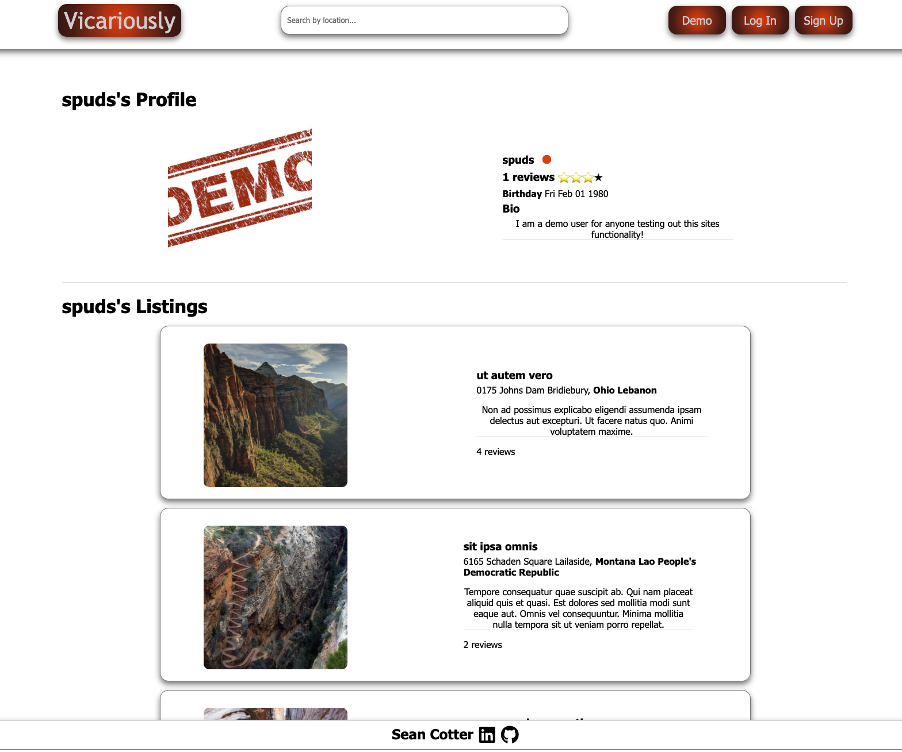
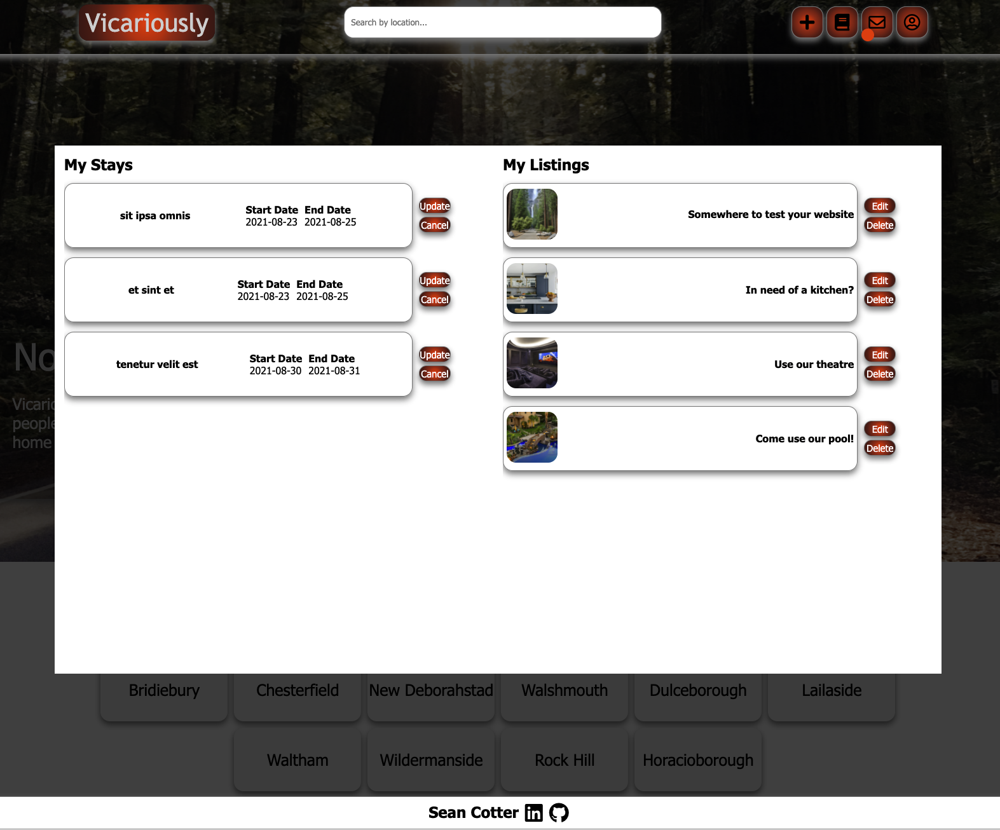

# Vicariously

## This app is meant to be a clone of couchsurfing.com with a twist.

V1 was a 1 week solo project for App Academy made by Sean Cotter. The minimum requirements were to have 2 full CRUD features and documentation. The 'clone' I chose was couchsurfing.com/airbnb.com.

It was to have:
- Spots
- Bookings
- Reviews

Bonus Items were:
- Search (location/availability) + Google Maps
- Messaging
- User/Host profiles
- AWS Upload for images

Pitch:

This site will allow users to post anything in their home to share with a new friend via vicariously. Some might choose to share their gorgeous backyard with a pool and pizza oven, while others may choose to share their master bathrooms with some road weary travellers. Everyone has something in their home that could go a long way to help a friend in need.

This site is meant for anyone, and any thing! Your new neighborhood is just a click away, whether you're on the road or even in the same town.

## To set up locally ( V1 )

### Create environment variables based of sample.env

1. Download the zip file
2. Open with preferred editor
3. Use the command 'npm install' in a terminal for both the front-end and back-end sections, the back-end will run on port 5000 and the front-end will run on port 3000
4. Use the command 'npm start' for each end, navigate to port 3000 to view the website, and port 5000 to make fetch calls to the api

## Technologies Used

- Javascript
- HTML
- CSS
- Node.js
- Postgres
- Sequelize
- Express
- React
- Redux
- Hosted on Heroku @ vicariously.herokuapp.com
- Github

## Database Structure

Postgres/Sequelize

### Some Things I Learned:
- The biggest flaw in my development was not setting myself up to handle the data correctly from the beginning. I split things off into different categories too quickly and ended up having to make too many requests to my server as well as deal with spread out or inaccessible data.
- I did not develop for mobile first, with the type of app this is, this should have been a priority.
- I definitely took on way too much for such a short period of time and so it's not perfect, it would have made much more sense to scale back and get everything absolutely the way I wanted it.
- I sunk a lot of time into things I didn't know how to do, lots of time researching and trying to find new things to add. This was fun, but it was a major waste of time in a lot of cases. Towards the end of the week I scaled it back and just focused on functionality. If I had done this from the beginning, time management would have been much easier.
- There's no prize for struggling!

### Check out the wiki to see my documentation
- https://github.com/Cotter45/Vicariously/wiki

### Some Screenshots

