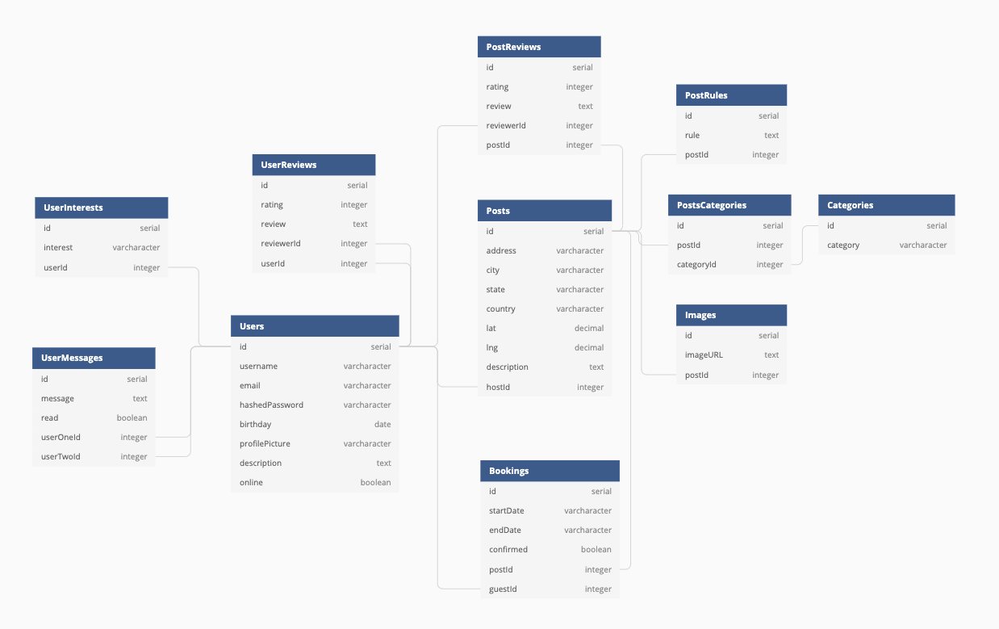

# Vicariously

## This app is meant to be a clone of couchsurfing.com with a twist.

This site will allow users to post anything in their home to share with a new friend via vicariously.
Some might choose to share their gorgeous backyard with a pool and pizza oven, while others may choose to
share their master bathrooms with some road weary travellers. Everyone has something in their home that
could go a long way to help a friend in need.

This site is meant for anyone, and any thing! Our time here is temporary, just like in kindergarten, 'Sharing is Caring'!

## Database Structure

The back end of this app is a Postgres Database, using express and sequelize to bring the data.

#### Table and Relationship Design

### how to set up locally

### technologies used
